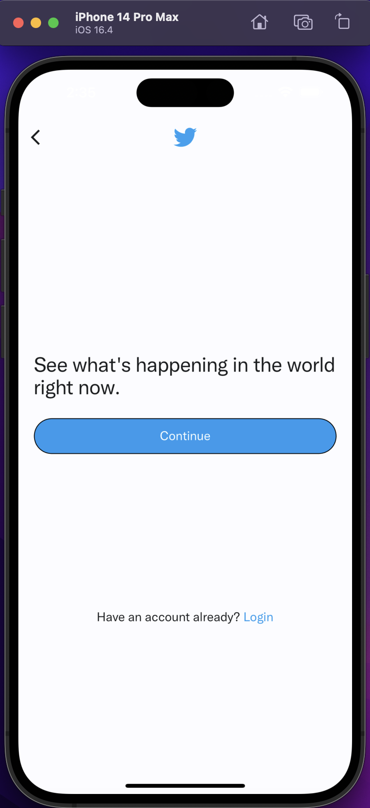

# Twitter Clone 

A twitter clone made with Dart, taking flutter as frontend service and firebase as backend service

 <space> 

## Tech Stack

**Client:** Flutter

**Server:** Firebase

## Screenshots

## Author

- [@recruitchaos](https://www.github.com/recruitchaos)

## Demo

Insert gif or link to demo

